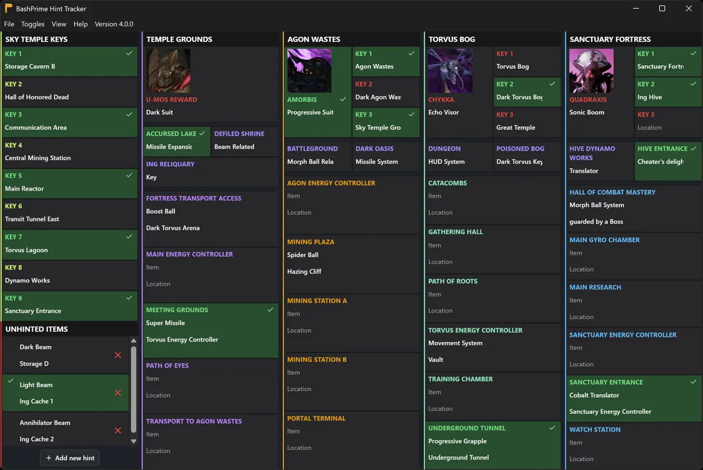

<div align="center">
  
</div>

# BashPrime Hint Tracker

A universal tracker for organizing your [randomizer](docs/Randomizer.md) hints. Just download a pack or [create your own pack](docs/Pack.md), install, and enjoy a rich, customizable note-taking experience.

## Getting Started

1. Download an installer or portable build for Windows, macOS, or Linux at the [Releases page](https://github.com/BashPrime/prime-hint-tracker/releases).
2. Download and install a tracker pack (no website yet, sorry!)
3. Click on the pack you want to use
4. Enjoy!

## Screenshot



## How to Use

- You can right-click any of the hint panels to give them a checkmark. This is useful for knowing which hints have been solved, which keys have been obtained, which bosses have been defeated, etc. You can remove the checkmark by right-clicking the hint panel again.
- Your tracker will automatically save its progress after each change. If you close and re-open the tracker pack at a later time, your existing progress will be restored.
- You can manually save and load your tracker states by going to **File > Import** and **File > Export**.
- You can reset the tracker state by clicking **File > Reset Tracker**.
- If your window feels too small or large, instead of dragging the corners with a mouse, you can hit **Reset Size** to reset the window to fit the content.
  - This can be done automatically when loading a pack by checking **Use Pack's Default Window Size on Load** in **File > Toggles**.
  - You can also zoom in and out from **File > View** or by hitting `Ctrl -` and `Ctrl Shift +`, respectively.
- The tracker supports light and dark mode! This can be switched manually from **File > Toggles > Theme**.

## Development

### Prerequisites

You will need `pnpm`. I recommend installing Node.js and then installing it via `corepack`:

```bash
corepack enable pnpm
```

### Install the project dependencies

```bash
pnpm install
```

### Run in development mode

```bash
pnpm run dev
```

Development mode gives you access to the Chromium Developer Tools, as well as the Jotai and Tanstack Router devtools found in the bottom corners of the React renderer.

### Visual Studio Code Debugging

This project is configured for use with the Visual Studio Code debugger. You can launch the debugger by pressing F5.

### Create a Production Build

To build for production, run one of the following commands (depending on your operating system):

```bash
pnpm run dist:win # Windows 64-bit
pnpm run dist:mac # macOS ARM
pnpm run dist:linux # Linux 64-bit
```

The application will be built in the `<project root>/dist` directory.